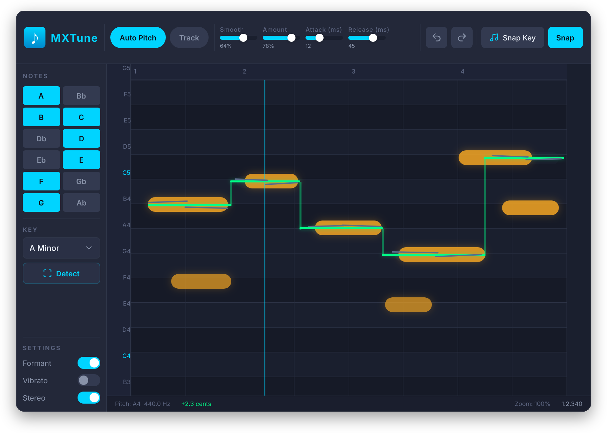

# UI Modernization Plan

> Prerequisite: None — can run in parallel with `01_JUCE8_UPGRADE.md`, but the
> actual implementation must target JUCE 8 (Metal/Direct2D backends).
> Do not merge UI work built on JUCE 7.

---

## Goal

Replace the current pixel-positioned, raw-colour JUCE 7 UI with a cohesive,
hardware-accelerated design system that matches the aesthetic of professional
DAW plugins (iZotope, FabFilter, Melodyne).

**Done when:** The plugin renders the layout described in this document at
60fps on macOS (Metal) and Windows (Direct2D), with all existing functionality
intact.

---

## Reference Design

*Generated with Pencil AI — `mockup_v1.png` in this folder.*

---

## Design System

### Colour Tokens

| Token | Hex | Usage |
|:------|:----|:------|
| `bg-base` | `#1a1f2e` | Main window background |
| `bg-surface` | `#212736` | Sidebar and panel backgrounds |
| `bg-surface-alt` | `#252b3b` | Alternating row shading (accidental semitones) |
| `bg-control` | `#2a3147` | Slider tracks, inactive toggle backgrounds |
| `accent-primary` | `#00d4ff` | Active toggles, selected notes, playhead, highlights |
| `accent-primary-dim` | `#0099bb` | Hover states for accent elements |
| `note-blob` | `#f5a623` | Pitch correction node blobs |
| `note-blob-glow` | `#f5a62340` | Blob ambient glow (25% opacity) |
| `pitch-out` | `#00ff88` | Corrected output pitch line |
| `pitch-in` | `#6b7fa3` | Raw input pitch line |
| `playhead` | `#00d4ff` | Playhead vertical indicator (dashed) |
| `grid-note-active` | `#ffffff22` | Horizontal grid line — enabled note row |
| `grid-note-inactive` | `#ffffff0a` | Horizontal grid line — disabled note row |
| `grid-beat` | `#ffffff18` | Vertical beat marker lines |
| `text-primary` | `#e8eaf0` | Labels, button text |
| `text-secondary` | `#8892a4` | Subdued labels, note names on grid |
| `text-disabled` | `#4a5568` | Inactive controls |
| `border-subtle` | `#ffffff12` | Panel separators, control outlines |

### Typography

| Role | Typeface | Size | Weight |
|:-----|:---------|:-----|:-------|
| Plugin title | Inter / SF Pro | 14px | SemiBold |
| Control labels | Inter / SF Pro | 11px | Regular |
| Slider values | Inter Mono / SF Mono | 11px | Regular |
| Grid note names | Inter / SF Pro | 10px | Regular |
| Status bar | Inter Mono / SF Pro | 10px | Regular |

### Spacing & Geometry

| Property | Value |
|:---------|:------|
| Window default size | 860 × 600 px |
| Window minimum size | 860 × 600 px |
| Corner radius (outer frame) | 12 px |
| Corner radius (controls) | 6 px |
| Corner radius (note blobs) | 6 px |
| Top bar height | 48 px |
| Left sidebar width | 136 px |
| Status bar height | 24 px |
| Grid pitch label margin | 28 px |
| Control padding | 8 px |
| Section gap | 12 px |

---

## Layout Breakdown

### Top Control Bar (48px, full width)

Left to right:
1. **Logo mark** — small gradient icon + "MXTune" wordmark
2. **Auto Pitch** — pill toggle (`accent-primary` when on, `bg-control` when off)
3. **Track** — pill toggle, same style
4. **Sliders** — `Smooth`, `Amount`, `Attack (ms)`, `Release (ms)` — horizontal
   flat sliders with filled track, value readout below label. Width: ~80px each.
5. **Spacer** (flex)
6. **Undo / Redo** — icon buttons (arrow icons), no label
7. **Snap Key** — outlined button
8. **Snap** — outlined button

### Left Sidebar (136px wide, full height minus top bar)

Top to bottom:

**NOTES section**
- Section label `NOTES` in `text-secondary`, 10px, uppercase
- 6 × 2 grid of note toggle buttons (A, Bb, B, C, Db, D, Eb, E, F, Gb, G, Ab)
  - Active: `accent-primary` fill, white text
  - Inactive: `bg-control` fill, `text-secondary` text
  - Size: 52 × 26 px, 6px corner radius, 4px gap

**KEY section**
- Dropdown — `A Minor` style, `bg-control` background, chevron icon
- **Detect** button — full width, outlined style

**SETTINGS section**
- Toggles for: `Formant`, `Vibrato`, `Stereo` — label left, iOS-style pill
  toggle right, `accent-primary` when on

### Main Pitch Editor (remaining space)

**Time ruler** (20px height at top of graph)
- Beat numbers (1, 2, 3, 4…) in `text-secondary`
- Subtle vertical tick marks in `grid-beat`

**Pitch grid**
- Rows: one per semitone, full-width horizontal lines
- Natural note rows (C, D, E…): `bg-surface` background
- Accidental rows (Bb, Db…): `bg-surface-alt` background (subtle shading)
- Pitch labels on left margin: `text-secondary`, 10px
- Octave labels (C3, C4…): `text-primary`, 10px, slightly bolder

**Pitch content layers** (bottom to top):
1. Waveform thumbnail — very faint, `#ffffff08`, behind everything
2. Beat grid lines — `grid-beat`, 1px
3. Input pitch line — `pitch-in`, 1.5px stroke
4. Note blobs — `note-blob` fill, `note-blob-glow` outer glow, 6px radius
5. Output pitch line — `pitch-out`, 2px stroke, rendered above blobs
6. Playhead — `playhead` dashed vertical line, 1px, `accent-primary`

**Status bar** (24px, bottom of graph)
- Left: current pitch + cents offset (e.g. `Pitch: A4  +2.3 cents`)
- Right: zoom level + time position (e.g. `Zoom: 50%  1:2.5m`)

---

## Changes from Current UI

| Area | Current | Target |
|:-----|:--------|:-------|
| Background | `#323e44` (muted teal) | `#1a1f2e` (deep navy) |
| Buttons | Plain JUCE `TextButton` | Pill-shaped with fill/outline variants |
| Toggles | JUCE `ToggleButton` (checkbox style) | iOS-style pill toggle |
| Sliders | JUCE `LinearBar` | Flat track + filled bar + value readout |
| Note grid buttons | Raw `ToggleButton` | Styled grid with active/inactive states |
| Note blobs | `juce::Colours::orange` flat rect | Amber fill + ambient glow |
| Output pitch | `juce::Colours::green` (pure green) | `#00ff88` rendered above blobs |
| Typography | Default JUCE font, 15pt | Inter/SF Pro, 10–14pt |
| Pitch label margin | 24px left margin | 28px, right-aligned in dedicated column |
| Status info | None | Status bar below graph |
| Corner radius | Square window | 12px outer frame |

---

## Implementation Approach

### Step 1 — Design Token Header

Create `JUCE/Source/MXTuneTheme.h` with all colour tokens and dimension
constants as `constexpr`. Every paint call and component uses tokens — no
hardcoded hex values anywhere in UI code.

### Step 2 — Custom LookAndFeel

Create `MXTuneLookAndFeel` subclassing `juce::LookAndFeel_V4`. Override:
- `drawButtonBackground()` — pill shape with fill/outline variants
- `drawToggleButton()` — iOS-style pill
- `drawLinearSlider()` — flat track with filled bar
- `drawScrollbar()` — thin, minimal
- `drawGroupComponentOutline()` — subtle separator, no visible border box

### Step 3 — Pitch Grid Repaint

Refactor `PluginGui::paint()` graph section:
- Use `juce::Path` fills per row for alternating backgrounds (faster than per-pixel)
- Draw note blobs with `juce::DropShadow` for glow effect
- Draw pitch lines last (above blobs)

### Step 4 — Layout Refactor

Replace all absolute pixel positions with proportional anchoring so the layout
adapts cleanly when resized. Minimum size stays 860 × 600.

### Step 5 — Status Bar

Add a new `MXTuneStatusBar` component at the bottom of the graph showing live
pitch, cents offset, zoom, and time position.

---

## Risk Register

| Risk | Mitigation |
|:-----|:-----------|
| JUCE 8 font loading (Inter not bundled) | Use `juce::Font` with `Typeface::createSystemTypefaceFor()` and fall back to default sans-serif |
| Glow effects performance on low-end machines | Make glow optional via a "performance mode" setting; use single `DropShadow` pass per frame |
| Resizing breaks pixel-positioned controls | Implement layout in `resized()` using proportional ratios, test at 860×600 and 1720×1200 |

---

## Branch

`feature/ui-modernization` — branch off `master` after JUCE 8 upgrade is merged.
