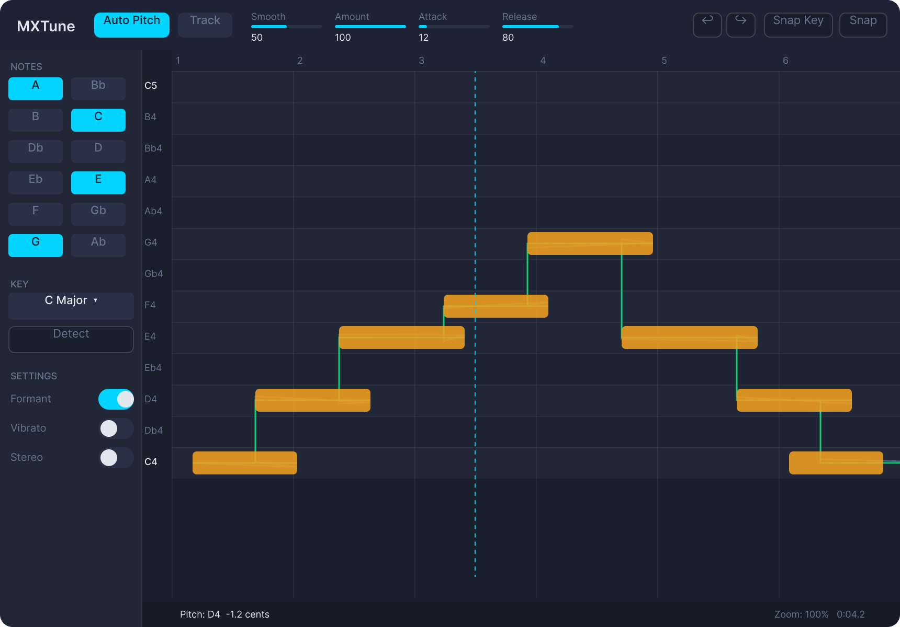

# UI Modernization Plan

> Prerequisite: None — can be designed in parallel with plans 1–2, but must
> be implemented on JUCE 8 after `01_JUCE8_UPGRADE.md` is merged.
> Do not merge UI work built on JUCE 7.

---

## Goal

Replace the current pixel-positioned, raw-colour JUCE 7 UI with a cohesive,
hardware-accelerated design system. Target aesthetic: clean, flat, professional
— similar to FabFilter Pro-Q or Linear's dashboard. No glows, no gradients on
content, no drop shadows on note blobs.

**Done when:** The plugin renders the layout described in this document at
60fps on macOS (Metal) and Windows (Direct2D), with all existing functionality
intact.

---

## Reference Design

---

## Design System

### Colour Tokens

| Token | Hex | Usage |
|:------|:----|:------|
| `bg-base` | `#1a1f2e` | Main window background |
| `bg-surface` | `#212736` | Sidebar, panel backgrounds, natural note rows |
| `bg-surface-alt` | `#1e2333` | Accidental semitone rows (Bb, Db, Eb, Gb, Ab) |
| `bg-control` | `#2a3147` | Slider tracks, inactive toggle and button backgrounds |
| `accent-primary` | `#00d4ff` | Active toggles, selected notes, playhead |
| `accent-primary-dim` | `#0099bb` | Hover state for accent elements |
| `note-blob` | `#f0a020` | Pitch correction node blobs — flat solid fill, no glow |
| `pitch-out` | `#00e676` | Corrected output pitch line |
| `pitch-in` | `#5c7a9e` | Raw input pitch line |
| `playhead` | `#00d4ff` | Playhead vertical indicator (dashed, 1px) |
| `grid-beat` | `#ffffff10` | Vertical beat marker lines |
| `text-primary` | `#e2e8f0` | Labels, button text |
| `text-secondary` | `#64748b` | Subdued labels, section headers, note names on grid |
| `text-disabled` | `#3a4258` | Inactive controls |
| `border-subtle` | `#ffffff10` | Panel separators, control outlines |

### Typography

| Role | Typeface | Size | Weight |
|:-----|:---------|:-----|:-------|
| Plugin title | Inter / SF Pro | 14px | SemiBold |
| Control labels | Inter / SF Pro | 11px | Regular |
| Slider values | Inter Mono / SF Mono | 11px | Regular |
| Grid note names | Inter / SF Pro | 10px | Regular |
| Section headers | Inter / SF Pro | 10px | Regular, uppercase |
| Status bar | Inter Mono / SF Mono | 10px | Regular |

### Spacing & Geometry

| Property | Value |
|:---------|:------|
| Window default size | 860 × 600 px |
| Window minimum size | 860 × 600 px |
| Corner radius (outer frame) | 12 px |
| Corner radius (controls) | 6 px |
| Corner radius (note blobs) | 4 px |
| Top bar height | 48 px |
| Left sidebar width | 136 px |
| Status bar height | 24 px |
| Grid pitch label margin | 28 px |
| Control padding | 8 px |
| Section gap | 12 px |

---

## Layout Breakdown

### Top Control Bar (48px, full width)

Left to right:
1. **Logo** — "MXTune" wordmark in `text-primary`, 14px SemiBold
2. **Auto Pitch** — pill toggle (`accent-primary` fill when on, `bg-control` when off)
3. **Track** — pill toggle, same style
4. **Sliders** — `Smooth`, `Amount`, `Attack ms`, `Release ms` — flat horizontal
   sliders with filled track in `accent-primary`, numeric value readout beneath
   label. Width: ~80px each.
5. **Spacer** (flex)
6. **Undo / Redo** — icon-only buttons
7. **Snap Key** — outlined button (`border-subtle` border, `text-primary` text)
8. **Snap** — outlined button, same style

### Left Sidebar (136px wide, full height minus top bar)

**NOTES**
- 6 × 2 grid of note toggle buttons (A Bb B C Db D / Eb E F Gb G Ab)
- Active: `accent-primary` fill, white text
- Inactive: `bg-control` fill, `text-secondary` text
- Size: 52 × 26 px, 4px corner radius, 4px gap

**KEY**
- Dropdown: `bg-control` background, chevron, shows e.g. `A Minor`
- **Detect** — full-width outlined button

**SETTINGS**
- Rows: label left + pill toggle right for `Formant`, `Vibrato`, `Stereo`
- Toggle on: `accent-primary`; off: `bg-control`

### Main Pitch Editor (remaining space)

**Time ruler** (20px, top of graph)
- Beat numbers in `text-secondary`, 10px
- Thin vertical tick marks in `grid-beat`

**Pitch grid**
- One row per semitone
- Natural note rows: `bg-surface` fill
- Accidental rows: `bg-surface-alt` fill (slightly darker — no border, flat difference only)
- Pitch labels left margin: `text-secondary`, 10px
- Octave markers (C3, C4…): `text-primary`, slightly bolder

**Pitch content layers** (bottom to top):
1. Beat grid lines — `grid-beat`, 1px
2. Input pitch line — `pitch-in`, 1.5px stroke
3. Note blobs — `note-blob` flat solid fill, 4px corner radius, no shadow, no glow
4. Output pitch line — `pitch-out`, 2px stroke, above blobs
5. Playhead — `playhead` dashed, 1px, cyan

**Status bar** (24px, bottom of graph)
- Left: `Pitch: A4  +2.3 cents`
- Right: `Zoom: 50%  1:2.5m`

---

## Changes from Current UI

| Area | Current | Target |
|:-----|:--------|:-------|
| Background | `#323e44` | `#1a1f2e` |
| Buttons | Plain JUCE `TextButton` | Pill-shaped fill/outline variants |
| Toggles | JUCE checkbox `ToggleButton` | Pill toggle, iOS-style |
| Sliders | JUCE `LinearBar` | Flat track + filled bar + value readout |
| Note grid buttons | Raw `ToggleButton` | Styled grid, active/inactive states |
| Note blobs | `juce::Colours::orange` flat rect | `#f0a020` flat fill, 4px radius, no effects |
| Output pitch line | `juce::Colours::green` | `#00e676` rendered above blobs |
| Input pitch line | Slider thumb colour (dynamic) | `#5c7a9e` fixed muted blue |
| Typography | Default JUCE font, 15pt | Inter/SF Pro, 10–14pt |
| Pitch label margin | 24px | 28px, right-aligned in dedicated column |
| Status info | None | Status bar below graph |
| Corner radius | Square window | 12px outer frame |

---

## Implementation Steps

### Step 1 — Design Token Header
Create `JUCE/Source/MXTuneTheme.h` with all colour tokens and dimension
constants as `constexpr juce::Colour` and `constexpr int`. No hardcoded hex
values anywhere else in UI code.

### Step 2 — Custom LookAndFeel
Create `MXTuneLookAndFeel` subclassing `juce::LookAndFeel_V4`. Override:
- `drawButtonBackground()` — pill shape, fill and outlined variants
- `drawToggleButton()` — pill toggle
- `drawLinearSlider()` — flat track with filled bar
- `drawScrollbar()` — thin, minimal
- `drawGroupComponentOutline()` — invisible (use `border-subtle` separators manually)

### Step 3 — Pitch Grid Repaint
Refactor `PluginGui::paint()` graph section:
- `juce::Path` fills per row for alternating backgrounds
- Note blobs as plain `fillRoundedRectangle` — no `DropShadow`
- Pitch lines drawn last (above blobs)

### Step 4 — Layout Refactor
Replace all absolute pixel positions with proportional anchoring in `resized()`.
Minimum size stays 860 × 600.

### Step 5 — Status Bar
Add `MXTuneStatusBar` component at the bottom of the graph showing live pitch,
cents offset, zoom level, and time position.

---

## Risk Register

| Risk | Mitigation |
|:-----|:-----------|
| Inter not available on all systems | Use `juce::Font` with `Typeface::createSystemTypefaceFor()`, fall back to default sans-serif |
| Resizing breaks pixel-positioned controls | Implement layout in `resized()` with proportional ratios; test at 860×600 and 1720×1200 |

---

## Branch

`feature/ui-modernization` — branch off `master` after JUCE 8 upgrade is merged.
